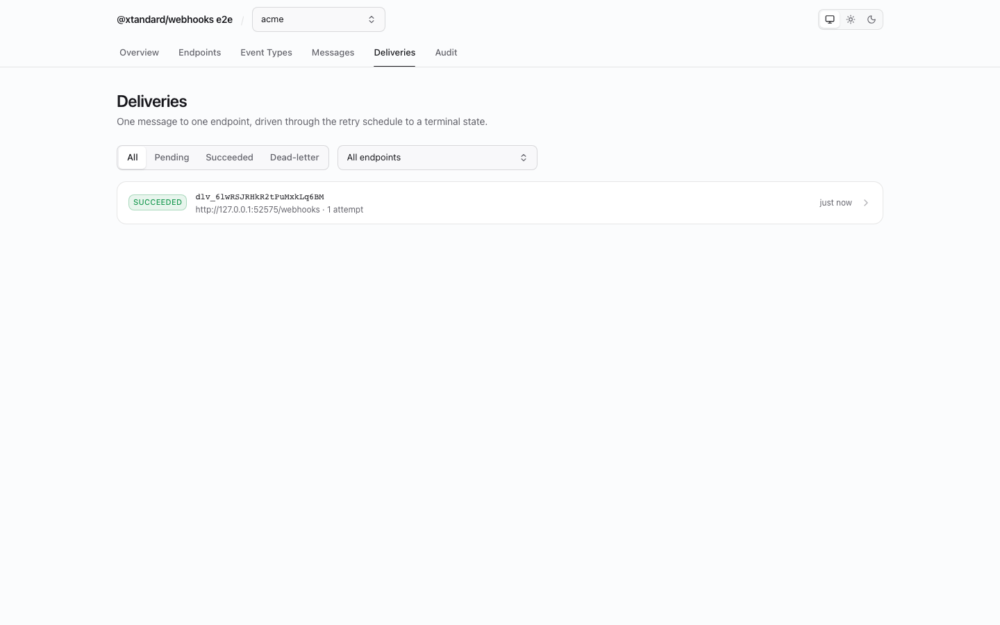
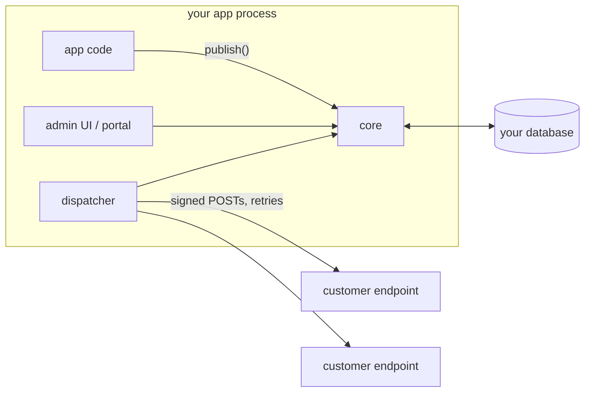
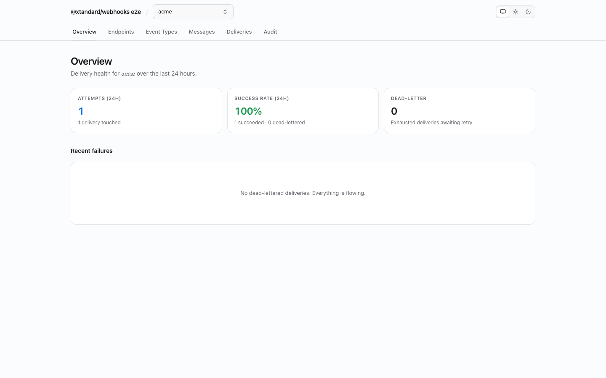
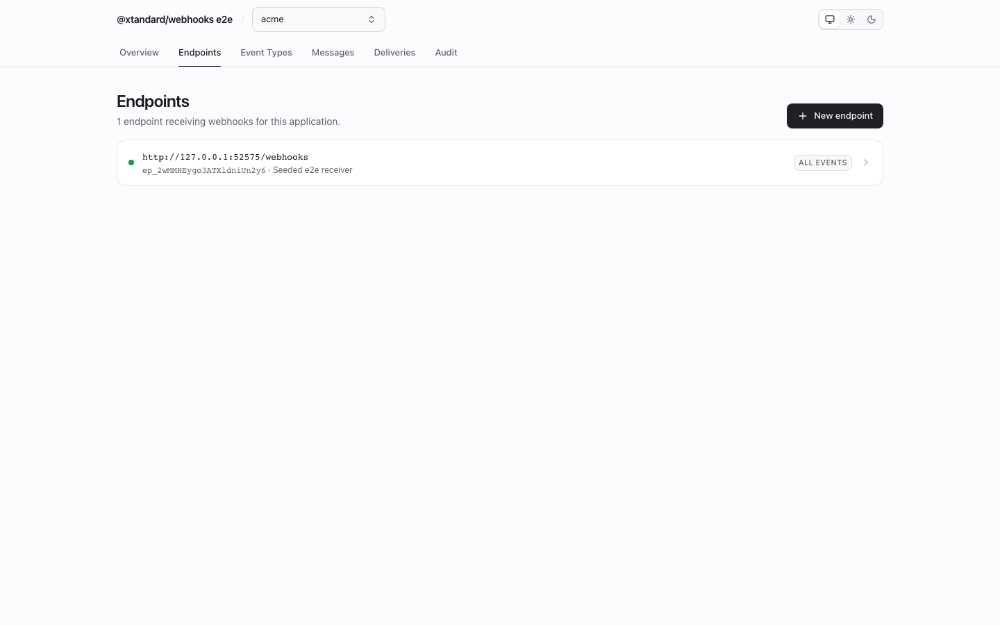

<div align="center">

# @xtandard/webhooks

**Self-hosted, embeddable, [Standard Webhooks](https://www.standardwebhooks.com)-compliant outbound-webhooks control plane.**

Mount it inside your existing app, point it at the database you already run, and ship signed events with retries, dead-lettering, and a customer-facing portal — no per-message SaaS pricing, no separate service to operate.

[](https://github.com/xantiagoma/xtandard-webhooks/actions/workflows/ci.yml)
[](https://www.npmjs.com/package/@xtandard/webhooks)
[](./LICENSE)



</div>

> `publish()` never blocks on a customer's server. Your app publishes; the dispatcher inside your process (or a dedicated worker running the same library) delivers; your customers self-serve through an embeddable portal.

## Contents

- [Why another webhooks tool?](#why-another-webhooks-tool)
- [How it works — the two planes](#how-it-works--the-two-planes)
- [Quickstart](#quickstart)
- [Send your first webhook](#send-your-first-webhook)
- [Verify on the receiving side](#verify-on-the-receiving-side)
- [The delivery model](#the-delivery-model)
- [The consumer portal](#the-consumer-portal)
- [Storage backends](#storage-backends)
- [Subpath exports](#subpath-exports)
- [Examples](#examples)
- [CLI](#cli)
- [Documentation](#documentation)
- [Project status](#project-status)

## Why another webhooks tool?

Webhook delivery is a library concern, not a service you rent or a second deployment you babysit.

- **Svix** is excellent — and a SaaS (or a heavyweight self-hosted server with its own Postgres/Redis to operate). This is `bun add` + the DB you already have.
- **Hookdeck / Convoy** are services to operate. Same objection.
- **Hand-rolled** senders reimplement signing, retries, and endpoint management — usually badly, always repeatedly. This packages the 20% everyone needs: applications, event types, endpoints, signed delivery, exponential retries, dead-letters, replay, observability, and a portal.

And because the wire contract is **Standard Webhooks**, your receivers verify with the official `standardwebhooks` libraries in Python, Go, Ruby, Java, Rust, PHP, or the zero-dependency `@xtandard/webhooks/receiver` — nothing bespoke on their side.

Sibling project: [`@xtandard/flags`](https://github.com/xantiagoma/xtandard-flags) — same architecture, same design system, for feature flags.

## How it works — the two planes



- **Control plane** — CRUD on applications, event types, endpoints; browsing messages/deliveries; replay. Hook-guarded, audited, auth'd.
- **Delivery plane** — `publish()` is one message write + fan-out (no HTTP, never throws because an endpoint is down). The in-process dispatcher owns all network I/O and retries; leases make it crash-safe and multi-instance-safe. At-least-once semantics; receivers dedupe on `webhook-id`.

Kill the process mid-retry-schedule and restart it: pending deliveries resume. The admin UI can be completely unmounted and delivery still works.

## Quickstart

<details>
<summary><b>Standalone (Docker)</b></summary>

```sh
docker run -p 3000:3000 -e STORAGE_DRIVER=memory ghcr.io/xantiagoma/xtandard-webhooks
# open http://localhost:3000
```

</details>

<details>
<summary><b>CLI (npx / bunx)</b></summary>

```sh
bunx @xtandard/webhooks serve   # STORAGE_DRIVER=file by default → ./.webhooks
```

</details>

<details>
<summary><b>Elysia</b></summary>

```ts
import { Elysia } from "elysia";
import { webhooksPanel } from "@xtandard/webhooks/elysia";
import { createMemoryStorage } from "@xtandard/webhooks/storage/memory";

const webhooks = webhooksPanel({ storage: createMemoryStorage() });
new Elysia().mount("/webhooks", webhooks.fetch).listen(3000);
```

</details>

<details>
<summary><b>Hono</b></summary>

```ts
import { Hono } from "hono";
import { webhooksPanel } from "@xtandard/webhooks/hono";
import { createMemoryStorage } from "@xtandard/webhooks/storage/memory";

const app = new Hono();
app.route("/webhooks", webhooksPanel({ storage: createMemoryStorage() }));
```

</details>

<details>
<summary><b>Express</b></summary>

```ts
import express from "express";
import { webhooksPanel } from "@xtandard/webhooks/express";
import { createMemoryStorage } from "@xtandard/webhooks/storage/memory";

const app = express();
app.use("/webhooks", webhooksPanel({ storage: createMemoryStorage() })); // before body-parser
app.listen(3000);
```

</details>

<details>
<summary><b>Bun</b></summary>

```ts
import { webhooksPanel } from "@xtandard/webhooks/bun";
import { createMemoryStorage } from "@xtandard/webhooks/storage/memory";

const webhooks = webhooksPanel({ storage: createMemoryStorage(), basePath: "/webhooks" });
Bun.serve({ port: 3000, fetch: webhooks.fetch });
```

</details>

Mounting the panel starts an in-process dispatcher by default (`dispatcher: false` for split-worker deployments).

## Send your first webhook

```ts
const { core } = webhooks;

await core.createApplication({ key: "acme" }); // your customer
await core.upsertEventType({ name: "invoice.paid" }); // the catalog
await core.createEndpoint("acme", {
  url: "https://api.acme-customer.com/webhooks", // their receiver
  eventTypes: ["invoice.paid"],
});

// The hot path — in the handler where the thing actually happens:
await core.publish("acme", {
  eventType: "invoice.paid",
  payload: { invoiceId: "inv_123", amount: 4200 },
  idempotencyKey: `invoice-paid-inv_123`, // safe to call twice
});
```

## Verify on the receiving side

TypeScript (this package, zero deps, any WinterCG runtime):

```ts
import { verifyWebhook } from "@xtandard/webhooks/receiver";

export default async function handler(request: Request) {
  const event = await verifyWebhook(request, process.env.WEBHOOK_SECRET!); // throws if invalid
  // event.type === "invoice.paid", event.data === { invoiceId, amount }
  return new Response("ok");
}
```

Python / Go / anything — the **official** Standard Webhooks libraries verify deliveries from this package unmodified:

```python
from standardwebhooks.webhooks import Webhook
payload = Webhook(secret).verify(body, headers)  # raises on failure
```

`examples/receivers/` runs FastAPI + Go receivers against a live dispatcher as the interop proof. Details: [docs/SIGNING.md](docs/SIGNING.md).

## The delivery model

```txt
attempt:   #1      #2      #3      #4       #5      #6      #7
delay:     0s ───► 5s ───► 5m ───► 30m ───► 2h ───► 5h ───► 10h ──► dead-letter
                         (±10% jitter; fully configurable)
```

- Failures walk the schedule; exhaustion **dead-letters** (never silently drops) — visible in the UI with per-attempt HTTP detail, replayable one-at-a-time or in bulk (`recover` an endpoint since a timestamp).
- Endpoints failing every attempt for 5 consecutive days auto-disable (configurable); disabled endpoints hold deliveries and resume on enable.
- Every attempt hits the fire-and-forget `onDelivery` sink (metrics); terminal transitions fire `after` hooks (`delivery.succeeded` / `delivery.exhausted` — the offload point).
- Secret rotation keeps the old secret verifying for a 24h grace window, with both signatures in the header.

Details: [docs/DELIVERY.md](docs/DELIVERY.md).

## The consumer portal

The Svix "App Portal" experience, self-hosted: your customers manage their own endpoints and inspect their own deliveries inside your product, scoped by a signed token — no sessions, no proxy routes.

```tsx
// Your server: mint a token after your own auth
const token = await createPortalToken(process.env.PORTAL_SECRET!, customer.appKey);

// Your React frontend:
import { WebhooksPortal } from "@xtandard/webhooks/react";
import "@xtandard/webhooks/react/styles.css";

<WebhooksPortal baseUrl="/webhooks" token={token} />;
```

Cross-application access is denied by construction — the host's authorization is never consulted for portal principals. Details: [docs/PORTAL.md](docs/PORTAL.md).

## Storage backends

Point it at what you already run — the whole system sits on a four-method KV contract ([ADR 0005](docs/ADR/0005-storage-kv-contract-due-index.md)):

| Backend        | Subpath                                         | Notes                                                                       |
| -------------- | ----------------------------------------------- | --------------------------------------------------------------------------- |
| Memory         | `storage/memory`                                | dev/tests/demo; every capability                                            |
| File           | `storage/file`                                  | zero-dep persistence                                                        |
| Redis          | `storage/redis`                                 | native queue claiming (sorted set + Lua), pub/sub watch, JSON codec variant |
| Postgres       | `storage/postgres`                              | jsonb KV, lazy DDL                                                          |
| Drizzle        | `storage/drizzle` + `drizzle/{pg,mysql,sqlite}` | your ORM, your migrations                                                   |
| MongoDB        | `storage/mongodb`                               |                                                                             |
| SQLite (Bun)   | `storage/sqlite`                                | `bun:sqlite`                                                                |
| libSQL / Turso | `storage/libsql`                                |                                                                             |
| unstorage      | `storage/unstorage`                             | 20+ drivers via unjs                                                        |
| Cloudflare KV  | `storage/cloudflare-kv`                         | dispatch via cron trigger                                                   |

Split planes: control data in Postgres, delivery queue in Redis — `queueStorage`. Details: [docs/STORAGE.md](docs/STORAGE.md).

## Subpath exports

| Import                                   | What you get                                                                |
| ---------------------------------------- | --------------------------------------------------------------------------- |
| `@xtandard/webhooks`                     | core, dispatcher, panel handler, signing, portal tokens, hooks contract     |
| `…/receiver`                             | `verifyWebhook` — zero-dep verification of **any** Standard Webhooks sender |
| `…/signing`                              | low-level sign/verify primitives                                            |
| `…/schema`                               | types only                                                                  |
| `…/testing`                              | test core + verifying local receiver + drain helper                         |
| `…/storage/*`, `…/drizzle/*`             | storage adapters (optional peers)                                           |
| `…/auth/{none,basic,delegated}`          | authentication providers                                                    |
| `…/authorization/{none,roles,delegated}` | authorization providers                                                     |
| `…/hooks/log`                            | reference logging hook                                                      |
| `…/{elysia,hono,express,bun}`            | framework adapters                                                          |
| `…/react`, `…/react/styles.css`          | `<WebhooksDashboard>` + `<WebhooksPortal>` embeds                           |

## Examples

`bun run demo` boots a seeded playground on http://localhost:7789 — two applications, a grouped event catalog, healthy/flaky/dead endpoints producing real live attempt history, dead-letters to replay.

| Example                                                                               | Shows                                                                  |
| ------------------------------------------------------------------------------------- | ---------------------------------------------------------------------- |
| [`elysia`](examples/elysia) / [`hono`](examples/hono) / [`express`](examples/express) | panel + publish-on-user-action loop per framework                      |
| [`full-loop`](examples/full-loop)                                                     | sender + verifying receiver in one command; watch retries live         |
| [`portal-embed`](examples/portal-embed)                                               | `<WebhooksPortal>` inside a host React app                             |
| [`auth`](examples/auth)                                                               | none/basic/delegated + roles + portal side-by-side                     |
| [`receivers`](examples/receivers)                                                     | **polyglot proof**: official Python + Go libs verifying our deliveries |
| [`storage-drivers`](examples/storage-drivers)                                         | one contract, every backend                                            |
| [`postgres-redis`](examples/postgres-redis)                                           | split planes: control in Postgres, queue in Redis                      |
| [`split-worker`](examples/split-worker)                                               | web publishes, worker dispatches                                       |
| [`standalone-docker`](examples/standalone-docker)                                     | compose file for the image                                             |

## Screenshots

|                                       |                                         |
| ------------------------------------- | --------------------------------------- |
|  |  |

## CLI

```txt
xtandard-webhooks serve            # panel + dispatcher from env
xtandard-webhooks dispatch         # dispatcher only (split worker)
xtandard-webhooks init             # create an app + example event type
xtandard-webhooks list-apps
xtandard-webhooks list-endpoints --app acme
xtandard-webhooks publish --app acme --type invoice.paid --data '{"n":1}'
xtandard-webhooks retry --app acme --delivery dlv_…
xtandard-webhooks verify --secret whsec_… --payload-file body.json --headers-file headers.json
xtandard-webhooks listen --port 4000 --secret whsec_…   # local inspecting receiver
xtandard-webhooks sign --secret whsec_… --data '{"n":1}' --url http://localhost:4000
```

Env contract (storage drivers, auth, retention, `RETRY_SCHEDULE`, …): [docs/DEPLOYMENT.md](docs/DEPLOYMENT.md).

## Testing webhooks

Self-hosted equivalents of webhook.site / Svix Play / the Standard Webhooks simulator — no hosting, no accounts:

- **`xtandard-webhooks listen`** — a local inspecting receiver: point an endpoint at `http://localhost:4000` and every incoming webhook is pretty-printed; with `--secret` it verifies the signature (VERIFIED/FAILED) and answers 401 on failure so senders exercise their retry path.
- **`xtandard-webhooks sign`** — the signature playground: builds a fully signed request from a secret + payload, printing the headers/body and a ready-to-run `curl` (with `--url`).
- **Panel "Request" inspector** — on any delivery's detail, see the exact signed request it sends (method, URL, all headers including `webhook-signature`, body) with a Copy-as-curl button.
- **`@xtandard/webhooks/testing`** — programmatic: `createTestReceiver` (a verifying local receiver) + `drainDeliveries` for deterministic tests.

See [docs/TESTING.md](docs/TESTING.md).

## Documentation

[Getting started](docs/GETTING_STARTED.md) · [Architecture](docs/ARCHITECTURE.md) · [Delivery](docs/DELIVERY.md) · [Signing](docs/SIGNING.md) · [Storage](docs/STORAGE.md) · [Portal](docs/PORTAL.md) · [Auth](docs/AUTH.md) · [Authorization](docs/AUTHORIZATION.md) · [Hooks](docs/HOOKS.md) · [UI](docs/UI.md) · [Adapters](docs/ADAPTERS.md) · [Deployment](docs/DEPLOYMENT.md) · [Testing](docs/TESTING.md) · [Releases](docs/RELEASES.md) · [ADRs](docs/ADR)

## Project status

ZeroVer (`0.x`) and pre-first-publish: the surface is stabilizing, minor versions may break, and feedback shapes it — issues welcome. Anti-bloat is a core value: when a feature is composable from an existing primitive in ten lines, we document the recipe instead of shipping the subsystem.

## License

[MIT](./LICENSE)
