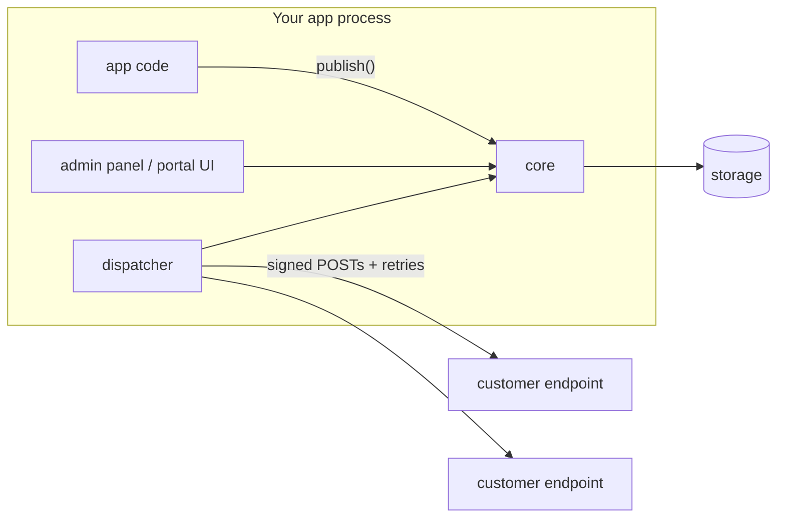

# Architecture

`@xtandard/webhooks` is one package with two planes and a pluggable storage floor.

## The two planes

|                | Control plane                                         | Delivery plane                                               |
| -------------- | ----------------------------------------------------- | ------------------------------------------------------------ |
| Surface        | admin API + UI + portal                               | `publish()` + dispatcher                                     |
| Traffic        | rare, human-driven                                    | hot, machine-driven                                          |
| Guards         | auth, authorization, `before` hooks (veto), audit log | payload limit, idempotency, quota via `message.publish` hook |
| Failure stance | fail loudly (4xx/5xx to the operator)                 | never fail the host; retry the remote party                  |

The reliability model in one paragraph:

> `publish()` never performs an HTTP call and never throws because an endpoint is down. The dispatcher owns all network I/O, retries, and failure accounting. A crashed process loses nothing: pending/claimed deliveries are persisted; leases expire; the next dispatcher tick picks them up. Semantics are at-least-once; receivers dedupe on `webhook-id`.

## Anatomy of a delivery

1. `core.publish(app, { eventType, payload })` validates (size, known event type, idempotency), writes one `Message` — including its wire envelope serialized **once**, so the signed bytes never change across retries — and fans out one `pending` `Delivery` per matching enabled endpoint, each with a due-index entry.
2. A dispatcher tick claims due deliveries (`status: "delivering"`, `leaseUntil = now + leaseMs`; the due entry moves to the lease expiry so crashed claimers self-heal).
3. Each claim is attempted: Standard Webhooks headers, all unexpired secrets signing, per-attempt timeout, static endpoint headers.
4. The outcome is recorded as a `DeliveryAttempt`; 2xx → `succeeded`; otherwise the next slot in the retry schedule (±10% jitter) or — schedule exhausted — `failed` (dead-letter). Endpoint failure streaks feed the auto-disable policy.
5. Terminal transitions fire `after` hooks (`delivery.succeeded` / `delivery.exhausted`); _every_ attempt hits the fire-and-forget `onDelivery` sink.

## Deployment shapes

1. **Embedded** (default) — panel + dispatcher inside the host app process. `webhooksPanel({ storage })` starts a dispatcher unless `dispatcher: false`.
2. **Split worker** — the host app only calls `publish()`; a separate process runs `xtandard-webhooks dispatch` (or the standalone image with the UI disabled) against the same storage. Requires claim-safe storage (native `claimDue` or `compareAndSwap`) when more than one dispatcher runs.
3. **Standalone** — the Docker image serves panel + dispatcher; the host publishes over the ingest API (`POST /api/applications/:app/messages`).

## Storage split

Control data (`storage`) and the delivery queue (`queueStorage`, defaults to `storage`) are separately pluggable: e.g. applications/endpoints/messages in Postgres, deliveries + due index in Redis (which claims natively via a sorted set). See `docs/STORAGE.md` and ADR 0005.

## Scale posture

This is a library optimized for the enormous middle: teams sending thousands-to-millions of webhooks a month from an app they already run. The due-index scan is per-application per tick (O(apps)); listing messages loads and sorts per app (retention keeps it bounded). If you are Svix-scale, run Svix.
