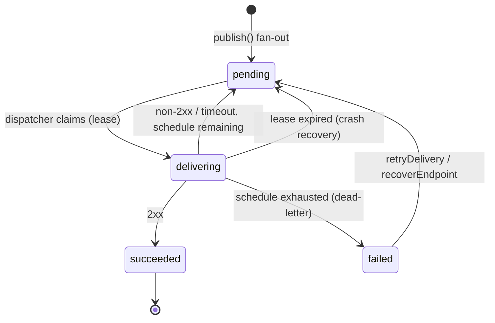

# Delivery

The delivery engine: retries, dead-letters, replay, and the guarantees behind them.

## Lifecycle



`failed` **is** the dead-letter state — nothing is ever silently dropped. Dead-letters stay queryable (`listDeliveries({ status: "failed" })`), fire the `delivery.exhausted` hook with the full attempt history (the offload point), and are replayable.

## The retry schedule

Default: `["0s", "5s", "5m", "30m", "2h", "5h", "10h"]` — seven attempts over ≈17.5 hours, Svix-compatible (ADR 0007). Entry `i` is the delay before attempt `i + 1`; every delay gets ±10% jitter. Configure per dispatcher:

```jsonc
// createDispatcher(core, { retrySchedule: ["0s", "1m", "15m", "1h"] })
// or via env for the CLI/standalone: RETRY_SCHEDULE=0s,1m,15m,1h
```

## Claiming and multi-instance safety

A tick claims up to `batchSize` due deliveries and processes them with `concurrency` workers. Claiming strategy is feature-detected, best first:

| Storage capability              | Claim path                                                  | Multi-dispatcher safe?      |
| ------------------------------- | ----------------------------------------------------------- | --------------------------- |
| `deliveryQueue` (memory, redis) | native `claimDue` (redis: atomic Lua pop from a sorted set) | yes                         |
| `compareAndSwap`                | due-index scan + CAS per delivery                           | yes                         |
| plain KV                        | due-index scan + read-modify-write                          | **no — run one dispatcher** |

Every claim takes a lease (`leaseMs`, default 60s). The due entry moves to the lease expiry, so if the claimer crashes mid-attempt the delivery re-surfaces automatically — kill -9 the process mid-retry and the next dispatcher resumes it. This is the at-least-once contract: after a crash between "receiver got it" and "we recorded it", the receiver may see a duplicate `webhook-id` and must dedupe (ADR 0008).

## What an attempt records

Each HTTP attempt persists a `DeliveryAttempt`: 1-based `attemptNumber`, timestamp, duration, `httpStatus` (absent on network error/timeout), truncated `responseBody` (default 4096 chars), truncated `error`, and its `trigger`:

| trigger    | Meaning                                                                 |
| ---------- | ----------------------------------------------------------------------- |
| `schedule` | the dispatcher's normal retry walk                                      |
| `manual`   | the first attempt after `retryDelivery` / `recoverEndpoint`             |
| `test`     | `sendExample` — never persisted as a delivery, wire-identical otherwise |

## Endpoint failure policy

- **Streaks**: every failed attempt stamps `endpoint.firstFailingAt` (once); any success clears it.
- **Auto-disable**: when the streak exceeds `autoDisable.failingForDays` (default 5), the endpoint is disabled with `disabledReason: "auto"` and `endpoint.auto-disabled` fires — notify your customer from that hook. Opt out with `autoDisable: false`.
- **Disabled endpoints hold, not fail**: their pending deliveries are parked and re-checked every `leaseMs`; re-enabling resumes delivery. Deliveries to a **deleted** endpoint fail terminally.

## Replay

| Operation                                     | Scope                                                     | Result                                                         |
| --------------------------------------------- | --------------------------------------------------------- | -------------------------------------------------------------- |
| `retryDelivery(app, id)`                      | one dead-letter                                           | back to `pending`, due immediately, attempt tagged `manual`    |
| `recoverEndpoint(app, endpointId, { since })` | all dead-letters for an endpoint created at/after `since` | re-queued in bulk                                              |
| `sendExample(app, endpointId, { eventType })` | none (synthetic)                                          | immediate signed test POST; result returned, nothing persisted |

## Observability

- `onDelivery` sink: one event per attempt (`ok`, `terminal`, `httpStatus`, `durationMs`, `trigger`) — fire-and-forget, feed Prometheus/logs from here.
- `after` hooks: terminal transitions only (`delivery.succeeded`, `delivery.exhausted`), keeping hook noise low.
- The UI's Deliveries view is the operational heart: filter by status (incl. dead-letter) and endpoint, inspect per-attempt HTTP detail, retry.
