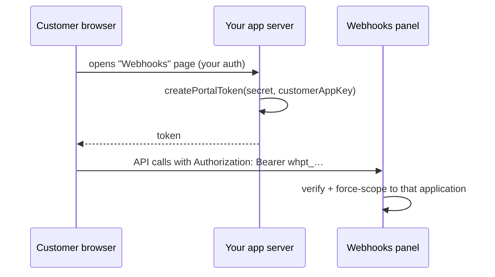

# Portal

The consumer portal is the flagship embed: your customers manage **their own** endpoints and inspect **their own** deliveries from inside your product — the Svix "App Portal" experience, self-hosted. It is not a second API or a second UI: the same routes and the same SPA bundle, force-scoped by a signed token (ADR 0006).

## The flow



## 1. Configure the panel

```ts
webhooksPanel({
  storage,
  portal: {
    secret: process.env.PORTAL_SECRET!, // any strong random string
    // allow: [...DEFAULT_PORTAL_ACTIONS]  ← the default grant, override to narrow/widen
  },
});
```

Default grant (`DEFAULT_PORTAL_ACTIONS`): manage own endpoints (incl. reading/rotating their secrets), read own messages and deliveries, retry dead-letters, read the event-type catalog. Not granted: anything application-, audit-, or publish-shaped.

## 2. Mint tokens server-side

```ts
import { createPortalToken } from "@xtandard/webhooks";

// In a route handler of YOUR app, after your own auth:
app.get("/api/webhooks-portal-token", async (ctx) => {
  const customer = await requireUser(ctx);
  return { token: await createPortalToken(process.env.PORTAL_SECRET!, customer.appKey) };
});
```

`createPortalToken(secret, applicationKey, { expiresIn })` — `expiresIn` defaults to `"7d"`. The token is `whpt_` + base64url payload + `.` + base64url HMAC-SHA256 signature; verification is stateless, signature-first, constant-time.

## 3. Embed

React (the flagship path — see `docs/UI.md` for props):

```tsx
import { WebhooksPortal } from "@xtandard/webhooks/react";
import "@xtandard/webhooks/react/styles.css";

<WebhooksPortal baseUrl="/webhooks" token={token} />;
```

The component sends the token as `Authorization: Bearer` on every API call; the panel answers `/config` with `portal: true` and the UI renders the reduced chrome (endpoints, messages, deliveries — no application switcher, no audit, read-only catalog).

## Scoping guarantees

- Only the token's application: any request touching another `:app` is denied.
- Only allowed actions: everything outside `portal.allow` is 403.
- Expired/tampered/malformed tokens: 401, always — a presented-but-invalid portal token never falls back to host auth.
- The host's authorization provider is **not consulted** for portal principals (ADR 0006): portal scoping wins even if host policy is buggy-permissive.
- Portal principals appear as `{ id: "portal:<app>", metadata: { portal: true, applicationKey } }` in audit entries and hook events.

## Operational notes

- Tokens are bearer credentials: HTTPS only, short `expiresIn` for sensitive tenants, and mint fresh per page load rather than storing them.
- Revocation before expiry = rotate `PORTAL_SECRET` (invalidates every outstanding token).
- The standalone/CLI accepts `PORTAL_SECRET` as an env var.
